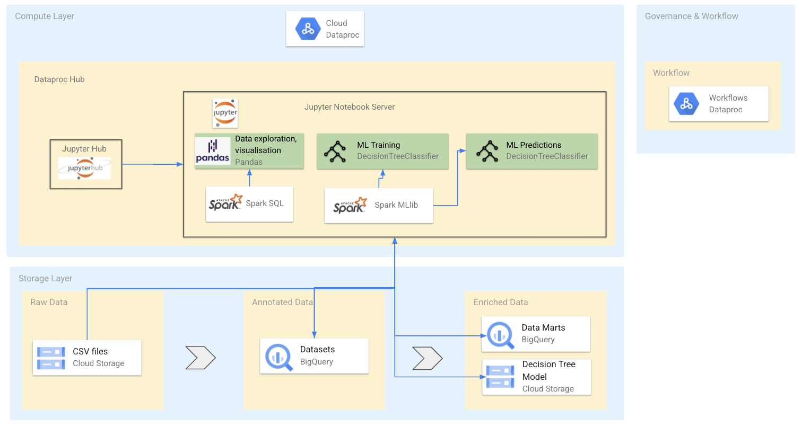

# Welcome to the Datalake Demo 

    Copyright 2020 Google LLC

    Licensed under the Apache License, Version 2.0 (the "License");
    you may not use this file except in compliance with the License.
    You may obtain a copy of the License at

     https://www.apache.org/licenses/LICENSE-2.0

    Unless required by applicable law or agreed to in writing, software
    distributed under the License is distributed on an "AS IS" BASIS,
    WITHOUT WARRANTIES OR CONDITIONS OF ANY KIND, either express or implied.
    See the License for the specific language governing permissions and
    limitations under the License.




# Apache Spark on Dataproc - Datalake Demo

The collection of notebooks illustrates a financial services company build a data lake on Google Cloud using Spark, Dataproc and BigQuery. The team consists of data enginers, data analysts and data scientists who work together to process raw data and enrich it by predicting fradulent transactions.

# Set-up Data Lake and Dataproc
This demo is designed to be run on Google Cloud Dataproc. Follow these steps to create create a Dataproc Cluster and then copy the notebook to your notebooks folder.

These steps should be run in the Google Cloud Shell

## 1 - Set env configuration
```
export REGION=<your-preferred-region>
export PROJECT_ID=<project-id>
gcloud services enable notebooks.googleapis.com
gcloud services enable dataproc.googleapis.com
gcloud iam service-accounts create datalake
gcloud projects add-iam-policy-binding $DEVSHELL_PROJECT_ID --member=serviceAccount:datalake@$DEVSHELL_PROJECT_ID.iam.gserviceaccount.com --role=roles/dataproc.admin
gcloud projects add-iam-policy-binding $DEVSHELL_PROJECT_ID --member=serviceAccount:datalake@$DEVSHELL_PROJECT_ID.iam.gserviceaccount.com --role=roles/dataproc.worker
gcloud projects add-iam-policy-binding $DEVSHELL_PROJECT_ID --member=serviceAccount:datalake@$DEVSHELL_PROJECT_ID.iam.gserviceaccount.com --role=roles/bigquery.admin
gcloud projects add-iam-policy-binding $DEVSHELL_PROJECT_ID --member=serviceAccount:datalake@$DEVSHELL_PROJECT_ID.iam.gserviceaccount.com --role=roles/iam.serviceAccountAdmin
gcloud projects add-iam-policy-binding $DEVSHELL_PROJECT_ID --member=serviceAccount:datalake@$DEVSHELL_PROJECT_ID.iam.gserviceaccount.com --role=roles/iam.serviceAccountUser

```
## 2 - Create GCS bucket
GCS bucket for Dataproc Clusters and temp storage.
```
export BUCKET_NAME=${PROJECT_ID}-data
gsutil mb -l ${REGION} gs://${BUCKET_NAME}
gsutil cp gs://2ca8b8fa-652a-11eb-8084-88e9fe60c70e/*.csv gs://${BUCKET_NAME}
gsutil cp gs://2ca8b8fa-652a-11eb-8084-88e9fe60c70e/cluster-config.yaml gs://${BUCKET_NAME}
```
## 3 - Create Dataproc Hub 

1) Create a Dataproc Hub instance
Go to the Dataproc→Notebooks instances page in the Cloud Console.

2) Click NEW INSTANCE → Dataproc Hub

3) On the New notebook instance page, provide the following information:

    1) Instance name: <project-id>-dataproc-hub instance name.
    2) Region - Select a region for the Dataproc Hub instance. Select europe-west3 if possible. Note: Dataproc clusters spawned by this Dataproc Hub instance will also be created in this region.
    For best performance, select a geographically close region.
    3) Zone: Select a zone within the selected region.
    4) Environment: Dataproc Hub
    5) Environment variables: Name=dataproc-configs Value=gs://${BUCKET_NAME}/cluster-config.yaml
    6) Machine configuration: Machine Type - Select the machine type for the Compute Engine. Set other Machine configuration options.
    7) Go to Permission: untick the "Use Compute Engine default service account" box --> specify datalake@<your-project-id>.iam.gserviceaccount.com as Service Account
    8) Click CREATE to launch the instance.

## 4 - Create a dataproc cluster using Dataproc Hub

1) When the instance is running, click the "OPEN JUPYTERLAB" link on the Notebooks instances page to access the instance.
2) In the cluster's configuration select cluster-config and the appropriate zone. Click Start.


## 4 - Launch JupyterLab
Once your cluster is ready go follow these steps to copy this notebook:

On the Dataproc cluster UI go to web interfaces tab
Cick on the link to open JupyterLab.
Go the Local Disk folder in JupyterLab
Click on the plus (+) button to open the launcher
Open terminal and run the cmd below to copy the notebook to your cluster
```
wget https://raw.githubusercontent.com/grubwieser/Datalake-training/main/1_Data_Engineer.ipynb
wget https://raw.githubusercontent.com/grubwieser/Datalake-training/main/2_Data_Analyst.ipynb
wget https://raw.githubusercontent.com/grubwieser/Datalake-training/main/3_Data_Scientist.ipynb
wget https://raw.githubusercontent.com/grubwieser/Datalake-training/main/4_Data_Ops.ipynb
```
## 5 - Run example code in the following notebook order 
```
1_Data_Engineer.ipynb - Convert CSV and store in BigQuery 
2_Data_Analyst.ipynb - Run SQL on tables and plot data
3_Data_Scientist.ipynb - Create ML models with Spark
4_Data_Ops.ipynb - Deploy Spark pipeline using Dataproc Workflows
```
